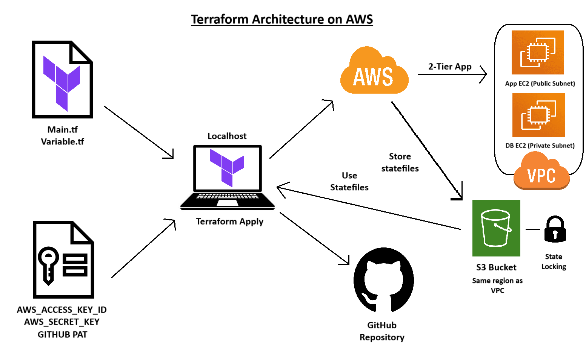

# Tech 258 - Terraform

## Terraform Overview
Terraform is an open-source Infrastructure as Code (IaC) tool developed by HashiCorp. By using Terraform, the provisioning and management of infrastructure can happen automatically, reducing the need for manual intervention.

## Why Terraform?
Terraform managing the provisioning of infrastructure ensures a variety of benefits:
- **Consistency**: Terraform reduces human error, ensuring that deployments remain consistent across all environments.
- **Scalability**: With predefined configurations, infrastructure can be easily replicated across development, staging, and production environments.
- **Faster Deployment**: Terraform automates and speeds up the deployment process, which can be further enhanced through continuous integration and continuous deployment (CI/CD) pipelines.

Implementing Terraform in a infrastructure orchestration strategy also offers business benefits too:
- **Cost Efficiency**: By automating infrastructure provisioning, time and resources spent on manual configurations are reduced, leading to lower operational costs.
- **Agility**: Rapidly deploy and scale infrastructure in response to business needs, enabling faster time-to-market for new features and services.
- **Enhanced Reliability**: Automation and consistency minimise the risk of errors and downtime, ensuring services are reliable and always available.
- **Cloud-Agnostic**: For some businesses, e.g. FinTech Banks, a multi-cloud solution is necessary by law. Terraform is cloud-agnostic meaning it can work with any cloud provider e.g. AWS/Azure/GCP, unlike other alternatives like AWS CloudFormation which is owned by and limited to AWS.

## Desired State vs Current State - How does Terraform Manage the State?

### Desired State
The desired state is the infrastructure configuration defined in your Terraform files. It specifies the resources you want, their properties, and how they should be configured.

### Current State
The current state is the actual state of your infrastructure as it exists. Terraform tracks this in a state file (`terraform.tfstate`), which contains details about all managed resources.

### Managing the State
Terraform manages the state by comparing the desired state with the current state:
1) **Initialisation** (`terraform init`): Sets up Terraform and initialises the state management.
2) **Planning** (`terraform plan`): Compares the desired state with current state, generating a plan showing the changes (if any) to align these two states.
3) **Applying** (`terraform apply`): Applys the plan, making the necessary changes to match the current state to the desired state. The state file is then updated to reflect these changes.

## Keeping our Terraform files secure
When working with Terraform, it's crucial to ensure that sensitive information and state files are kept secure. To prevent this information from being exposed or committed to version control, utilise the `.gitignore` file to prevent these files from being tracked. Example `.gitignore` file: <br>


## Terraform Architecture Diagram

## Installing Terraform
Follow the guide [here](https://developer.hashicorp.com/terraform/tutorials/aws-get-started/install-cli).

Verify the installation using Git Bash. Example: <br>


## Prerequisite for Terraform with AWS
  Ensure you store your `AWS_ACCESS_KEY_ID` and `AWS_SECRET_ACCESS_KEY` as environmental variables. 
**IMPORTANT**: Never hardcore your credentials!!!

A guide to do this is [here](https://phoenixnap.com/kb/windows-set-environment-variable).

Once this is done, restart your bash Terminal and `Run as administrator`. To verify your environmental variable have saved you can run the commands:
```
echo $AWS_ACCESS_KEY_ID
echo $AWS_SECRET_ACCESS_KEY
```
This will output your keys. **Do not share these with anyone!**

## Using Terraform with AWS
1) Create a new directory for the Terraform project e.g. `terraform-tech258`.
2) Create a new `main.tf` file. This file will store the configuration.

### What goes into the main.tf file?
1) Using AWS in this case, so enter the provider and the region to deploy our infrastructure in. Example:
```
provider "aws" {

        region = "eu-west-1"
}
```
Now, save the file and exit. Run `terraform init`. This will create a working directory for Terraform (`.terraform`), downloading the necessary provider plugins and modules e.g. AWS. Example output: <br>
 <br>
1) Go back into the `main.tf` file and set up the resources to deploy on AWS. In this case, making a file that deploys a EC2 instance.
We have to create a resource block for this. Example: <br>
```
# Which service/resource - EC2
resource "aws_instance" "app_instance" {

# which ami to use
        ami = "ami-02f0341ac93c96375"
# which type of instance - t2.micro
        instance_type = "t2.micro"
# associate public ip with this instance
        associate_public_ip_address = true

# name the ec2/resource
        tags = {
             Name = "shafique-tech258-terraform-app"
        }
}

```
3) Now, save the `main.tf` and use the command `terraform plan` to review the changes before deployment. Example output: <br>

1) Now, deploy the infrastructure using the command `terraform apply`. Add `-auto-approve` to bypass the confirmation prompt. Example output: <br>

1) To destroy the infrastructure, use the command `terraform destroy`. Add `-auto-approve` to bypass the confirmation prompt. Example output: <br>


### Summary
We have successfully gone through the main Terraform workflow of:
- Creating a `main.tf` configuration file
- Initialising Terraform (`terraform init`)
- Planning our configuration with Terraform (`terraform plan`)
- Deploying our infrastructure with Terraform (`terraform apply`)
- Destroying our infrastructure we created with Terraform (`terraform destroy`)

### Why use a variable.tf file?
Adding a `variable.tf` file in Terraform provides us with an abundance of benefits:
- **DRY - Dont Repeat Yourself**: We can utilise variables that are re-usable, otherwise we'd have to hardcode and repeat this for each occurence of the same hardcoded parameter.
- **Version Control**: Variables allow us to keep sensitive information out of our `main.tf` file. We can keep this secure by including `variable.tf` in our `.gitignore` file.

### What goes into the variable.tf file?
This file will contain the definitions of variables that will be used throughout our Terraform configuration. Example variable: <br>
```
# Declare the AWS region
variable "aws_region" {
        type = string
        default = "eu-west-1"
        description = "AWS region where we are deploying our resources"
}
```

Breaking this down:
1) Variable Declaration: Variable name and it's type
2) Default Value: The default value our variable will use (if no other value is provided).
3) Description: Explains the purpose of our variable.

## Using Terraform to create a new GitHub repository
1) Generate a Personal Access Token (PAT) on GitHub:
- Click on your GitHub `Profile Picture > Settings` <br>

- Navigate to `Developer Settings` <br>

- Choose `Personal access tokens` > `Fine-grained tokens` > `Generate new token` <br>

- Set up your PAT. Example: <br>


Important:
For Permissions: Make sure to set `Administration` to `Read and write` so Terraform has permissions to create a new repo.

2) Configure resource on Terraform. Example: <br>


**WARNING**: Make sure your `variable.tf` isn't tracked by GitHub to keep the token safe!

Our repo can now be automatically generated! Example: <br>

