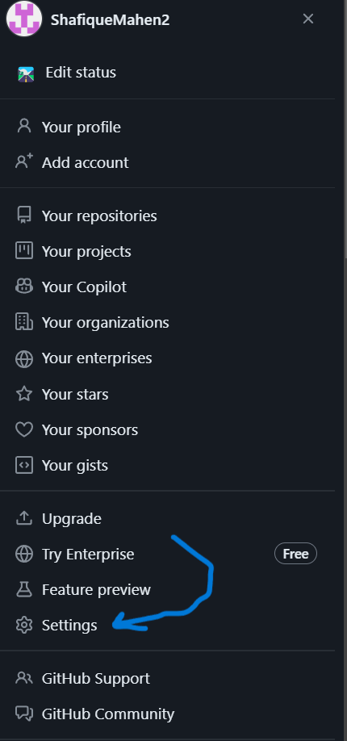
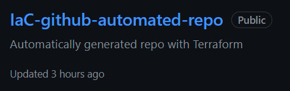

# Tech 258 - Terraform

- [Tech 258 - Terraform](#tech-258---terraform)
  - [Terraform Overview](#terraform-overview)
  - [Why Terraform?](#why-terraform)
  - [Desired State vs Current State - How does Terraform Manage the State?](#desired-state-vs-current-state---how-does-terraform-manage-the-state)
    - [Desired State](#desired-state)
    - [Current State](#current-state)
    - [Managing the State](#managing-the-state)
  - [Keeping Terraform files secure](#keeping-terraform-files-secure)
  - [Terraform Architecture Diagram](#terraform-architecture-diagram)
  - [Installing Terraform](#installing-terraform)
  - [Using S3 as a Remote Backend](#using-s3-as-a-remote-backend)
    - [How does this work?](#how-does-this-work)
      - [Initialisation:](#initialisation)
      - [Holding the Lock:](#holding-the-lock)
      - [Releasing the Lock:](#releasing-the-lock)
      - [Handling Locking Issues:](#handling-locking-issues)
  - [Prerequisite for Terraform with AWS](#prerequisite-for-terraform-with-aws)
  - [Using Terraform with AWS](#using-terraform-with-aws)
    - [What goes into the main.tf file?](#what-goes-into-the-maintf-file)
    - [Summary](#summary)
    - [Why use a variable.tf file?](#why-use-a-variabletf-file)
    - [What goes into the variable.tf file?](#what-goes-into-the-variabletf-file)
  - [Using Terraform to create a new GitHub repository](#using-terraform-to-create-a-new-github-repository)


## Terraform Overview
Terraform is an open-source Infrastructure as Code (IaC) tool developed by HashiCorp. By using Terraform, the provisioning and management of infrastructure can happen automatically, reducing the need for manual intervention.

## Why Terraform?
Terraform managing the provisioning of infrastructure ensures a variety of benefits:
- **Consistency**: Terraform reduces human error, ensuring that deployments remain consistent across all environments.
- **Scalability**: With predefined configurations, infrastructure can be easily replicated across development, staging, and production environments.
- **Faster Deployment**: Terraform automates and speeds up the deployment process, which can be further enhanced through continuous integration and continuous deployment (CI/CD) pipelines.

Implementing Terraform in a infrastructure orchestration strategy also offers business benefits too:
- **Cost Efficiency**: By automating infrastructure provisioning, time and resources spent on manual configurations are reduced, leading to lower operational costs.
- **Agility**: Rapidly deploy and scale infrastructure in response to business needs, enabling faster time-to-market for new features and services.
- **Enhanced Reliability**: Automation and consistency minimise the risk of errors and downtime, ensuring services are reliable and always available.
- **Cloud-Agnostic**: For some businesses, e.g. FinTech Banks, a multi-cloud solution is necessary by law. Terraform is cloud-agnostic meaning it can work with any cloud provider e.g. AWS/Azure/GCP, unlike other alternatives like AWS CloudFormation which is owned by and limited to AWS.

## Desired State vs Current State - How does Terraform Manage the State?

### Desired State
The desired state is the infrastructure configuration defined in your Terraform files. It specifies the resources you want, their properties, and how they should be configured.

### Current State
The current state is the actual state of your infrastructure as it exists. Terraform tracks this in a state file (`terraform.tfstate`), which contains details about all managed resources.

### Managing the State
Terraform manages the state by comparing the desired state with the current state:
1) **Initialisation** (`terraform init`): Sets up Terraform and initialises the state management.
2) **Planning** (`terraform plan`): Compares the desired state with current state, generating a plan showing the changes (if any) to align these two states.
3) **Applying** (`terraform apply`): Applys the plan, making the necessary changes to match the current state to the desired state. The state file is then updated to reflect these changes.

## Keeping Terraform files secure
When working with Terraform, it's crucial to ensure that sensitive information and state files are kept secure. To prevent this information from being exposed or committed to version control, utilise the `.gitignore` file to prevent these files from being tracked. Example `.gitignore` file: <br>


## Terraform Architecture Diagram

## Installing Terraform
Follow the guide [here](https://developer.hashicorp.com/terraform/tutorials/aws-get-started/install-cli).

Verify the installation using Git Bash. Example: <br>


## Using S3 as a Remote Backend
S3 storage can be used for the terraform.tfstate files. This is a great way to add a layer of security and allow them to be shared with other members of the team who will also be working with them. One issue that can arise is that multiple people are working across the state files at the same time without communicating this fact. This is why the state files need to be locked to ensure only one person is making changes at one time. This is automatically done locally but needs to be configured for remote management.

DynamoDB is a key-value and document database that handles large amounts of data and high request rates, making it ideal for a wide range of applications. By setting up state locking with S3 and DynamoDB, you ensure that your Terraform state is managed safely and consistently, allowing multiple users to collaborate without conflict. A single DynamoDB table can be used to lock multiple remote state files. While creating a S3 bucket and DynamoDB table are necessary you also need to set up the backend to declare that S3 and Dynamo will be used for locking/state management.

### How does this work?

#### Initialisation:

Run terraform init to initialize the backend configuration. Terraform will set up the S3 bucket for state storage and the DynamoDB table for state locking.
Acquiring a Lock:

When you run a Terraform command that modifies the state (e.g., terraform plan or terraform apply), Terraform will attempt to acquire a lock in the DynamoDB table.
If the lock is acquired successfully, Terraform proceeds with the operation.

#### Holding the Lock:

While the Terraform operation is in progress, the lock is held in the DynamoDB table. This prevents other Terraform operations from running concurrently and modifying the state file.

#### Releasing the Lock:

Once the operation is complete, Terraform releases the lock from the DynamoDB table, allowing other operations to proceed.

#### Handling Locking Issues:

If a Terraform operation is interrupted or fails to release the lock, you can manually remove the lock using the terraform force-unlock command with the lock ID.
Region Requirement:

The S3 bucket and the resources (such as EC2 instances) accessing it must be in the same AWS region to avoid cross-region data transfer costs and potential latency issues.
If your S3 bucket is in the eu-west-1 region, your EC2 instances should also be in the eu-west-1 region for optimal performance and cost.

## Prerequisite for Terraform with AWS
  Ensure you store your `AWS_ACCESS_KEY_ID` and `AWS_SECRET_ACCESS_KEY` as environmental variables. 
**IMPORTANT**: Never hardcore your credentials!!!

A guide to do this is [here](https://phoenixnap.com/kb/windows-set-environment-variable).

Once this is done, restart your bash Terminal and `Run as administrator`. To verify your environmental variable have saved you can run the commands:
```
echo $AWS_ACCESS_KEY_ID
echo $AWS_SECRET_ACCESS_KEY
```
This will output your keys. **Do not share these with anyone!**

## Using Terraform with AWS
1) Create a new directory for the Terraform project e.g. `terraform-tech258`.
2) Create a new `main.tf` file. This file will store the configuration.

### What goes into the main.tf file?
1) Using AWS in this case, so enter the provider and the region to deploy our infrastructure in. Example:
```
provider "aws" {

        region = "eu-west-1"
}
```
Now, save the file and exit. Run `terraform init`. This will create a working directory for Terraform (`.terraform`), downloading the necessary provider plugins and modules e.g. AWS. Example output: <br>
 <br>
1) Go back into the `main.tf` file and set up the resources to deploy. In this case, making a file that:
- Creates a VPC and sets up networking (subnets, route tables, etc).
- App EC2 Instance in Public Subnet.
- MongoDB EC2 Instance in Private Subnet.
- Uses an already setup S3 Bucket as a Remote Backend.
- Automatically generates a GitHub Repo named `IaC-github-automated-repo`. <br>

**Example main.tf configuration:** <br>
```
# ========PROVIDERS========

provider "aws" {
	region = "eu-west-1"
}

provider "github" {
  token = var.GITHUB_TOKEN
}

# ========GITHUB REPOSITORY========

resource "github_repository" "automated_repo" {
  name        = var.repo_name
  description = "Automatically generated repo with Terraform"
  visibility  = "public"
}

# ========S3 REMOTE BACKEND========

terraform {
  backend "s3" {
    bucket = "tech258-shafique-terraform-bucket"
    key = "dev/terraform.tfstate"
    region = "eu-west-1"
    
  }
}

# ========AWS ORCHESTRATION========

## ========VPC========
resource "aws_vpc" "app-vpc" {
    cidr_block = var.vpc_cidr_block

    tags = {
    Name = var.vpc_name
  }
}

## ========INTERNET GATEWAY========
resource "aws_internet_gateway" "gw" {
    vpc_id = aws_vpc.app-vpc.id
}

## ========ROUTE TABLE========
resource "aws_route_table" "app-route-table" {
    vpc_id = aws_vpc.app-vpc.id
    
    route {
        cidr_block = "0.0.0.0/0"
        gateway_id = aws_internet_gateway.gw.id
    }
    route {
        ipv6_cidr_block = "::/0"
        gateway_id = aws_internet_gateway.gw.id
    }

    tags = {
        Name = var.route_table_name
    }
}


## ========APP SUBNET========
resource "aws_subnet" "app-subnet" {
    vpc_id = aws_vpc.app-vpc.id
    cidr_block = var.app_subnet_cidr_block
    availability_zone = var.availability_zone
    tags = {
        Name = var.app_subnet_name
    }
}

## ========DB SUBNET========
resource "aws_subnet" "db-subnet" {
    vpc_id = aws_vpc.app-vpc.id
    cidr_block = var.db_subnet_cidr_block
    availability_zone = "eu-west-1a"

    tags = {
        Name = var.db_subnet_name
    }
}


## ========ASSOCIATE SUBNET WITH ROUTE TABLE========
resource "aws_route_table_association" "a" {
    subnet_id = aws_subnet.app-subnet.id
    route_table_id = aws_route_table.app-route-table.id
}

## ========APP SECURITY GROUP========
resource "aws_security_group" "tech258-shafique-allow-web" {
    name = "allow_web_traffic"
    description = "Allow TLS inbound traffic"
    vpc_id = aws_vpc.app-vpc.id
    
    ingress {
        description = "HTTPS"
        from_port = 443
        to_port = 443
        protocol = "tcp"
        cidr_blocks = ["0.0.0.0/0"]
    }
    ingress {
        description = "HTTP"
        from_port = 80
        to_port = 80
        protocol = "tcp"
        cidr_blocks = ["0.0.0.0/0"]
    }
    ingress {
        description = "SSH"
        from_port = 22
        to_port = 22
        protocol = "tcp"
        cidr_blocks = ["0.0.0.0/0"]        
    }
    ingress {
        description = "Node"
        from_port = 3000
        to_port = 3000
        protocol = "tcp"
        cidr_blocks = ["0.0.0.0/0"]
    }
    egress {
        from_port = 0
        to_port = 0
        protocol = "-1"
        cidr_blocks = ["0.0.0.0/0"]
    }

    tags = {
      Name = "tech258-shafique-allow-web"
    }
}

## ========DB SECURITY GROUP========
resource "aws_security_group" "tech258-shafique-allow-db" {
    name = "allow_db_traffic"
    description = "Allow TLS inbound traffic"
    vpc_id = aws_vpc.app-vpc.id
    
    ingress {
        description = "mongo"
        from_port = 27017
        to_port = 27017
        protocol = "tcp"
        cidr_blocks = ["0.0.0.0/0"]
    }
    ingress {
        description = "SSH"
        from_port = 22
        to_port = 22
        protocol = "tcp"
        cidr_blocks = ["0.0.0.0/0"]        
    }
    egress {
        from_port = 0
        to_port = 0
        protocol = "-1"
        cidr_blocks = ["0.0.0.0/0"]
    }

    tags = {
      Name = "tech258-shafique-allow-db"
    }
}


## ========CREATE DB========
resource "aws_instance" "db" {
    depends_on = [ aws_security_group.tech258-shafique-allow-db ]
    ami = var.db_ami_id
    instance_type = var.ec2_instance_type
    availability_zone = var.availability_zone
    
    key_name = var.key_name
    vpc_security_group_ids = [aws_security_group.tech258-shafique-allow-db.id]

    subnet_id = aws_subnet.db-subnet.id

    associate_public_ip_address = true

    user_data = "${file("user-data-mongo.sh")}"

    tags = {
        Name = "tech258-shafique-db"
    }

}


## ========CREATE APP========
resource "aws_instance" "app" {
    depends_on = [ aws_instance.db ]
    ami = var.ami_id
    instance_type = var.ec2_instance_type
    availability_zone = var.availability_zone
    
    key_name = var.key_name
    vpc_security_group_ids = [aws_security_group.tech258-shafique-allow-web.id]
    
    subnet_id = aws_subnet.app-subnet.id

    associate_public_ip_address = true

    user_data = templatefile("${path.module}/user-data-node.tftpl", {
    db_host = aws_instance.db.private_ip
  })

    tags = {
        Name = "tech258-shafique-app"
    }
}

```
1) Now, save the `main.tf` and use the command `terraform plan` to review the changes before deployment. Example output: <br>

1) Now, deploy the infrastructure using the command `terraform apply`. Add `-auto-approve` to bypass the confirmation prompt. Example output: <br>

1) To destroy the infrastructure, use the command `terraform destroy`. Add `-auto-approve` to bypass the confirmation prompt. Example output: <br>


### Summary
We have successfully gone through the main Terraform workflow of:
- Creating a `main.tf` configuration file
- Initialising Terraform (`terraform init`)
- Planning our configuration with Terraform (`terraform plan`)
- Deploying our infrastructure with Terraform (`terraform apply`)
- Destroying our infrastructure we created with Terraform (`terraform destroy`)

### Why use a variable.tf file?
Adding a `variable.tf` file in Terraform provides us with an abundance of benefits:
- **DRY - Dont Repeat Yourself**: We can utilise variables that are re-usable, otherwise we'd have to hardcode and repeat this for each occurence of the same hardcoded parameter.
- **Version Control**: Variables allow us to keep sensitive information out of our `main.tf` file. We can keep this secure by including `variable.tf` in our `.gitignore` file.

### What goes into the variable.tf file?
This file will contain the definitions of variables that will be used throughout our Terraform configuration. Example variable: <br>
```
# Declare the AWS region
variable "aws_region" {
        type = string
        default = "eu-west-1"
        description = "AWS region where we are deploying our resources"
}
```

Breaking this down:
1) Variable Declaration: Variable name and it's type
2) Default Value: The default value our variable will use (if no other value is provided).
3) Description: Explains the purpose of our variable.

## Using Terraform to create a new GitHub repository
1) Generate a Personal Access Token (PAT) on GitHub:
- Click on your GitHub `Profile Picture > Settings` <br>

- Navigate to `Developer Settings` <br>

- Choose `Personal access tokens` > `Fine-grained tokens` > `Generate new token` <br>

- Set up your PAT. Example: <br>


Important:
For Permissions: Make sure to set `Administration` to `Read and write` so Terraform has permissions to create a new repo.

2) Configure resource on Terraform. Example: <br>


**WARNING**: Make sure your `variable.tf` isn't tracked by GitHub to keep the token safe!

Our repo can now be automatically generated! Example: <br>
